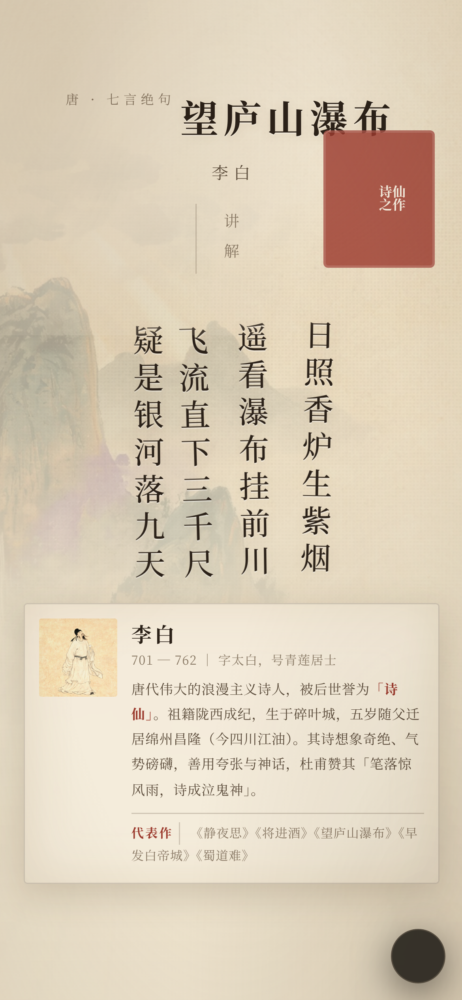
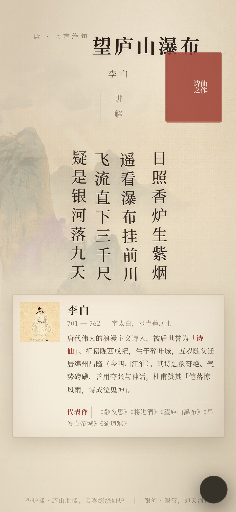
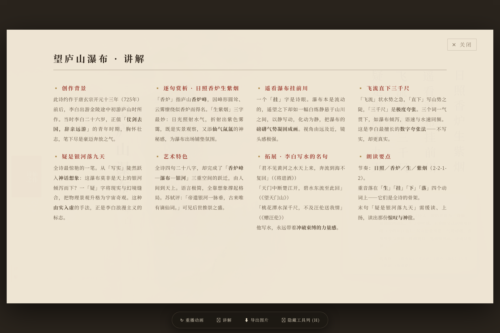

# 中国古诗词展示页面 · Chinese Poem Page

AI 出图 + 纯 HTML/CSS 合成的国风古诗展示。含诗页与诗文文化地图，无构建依赖，浏览器打开即用。

**技术栈**：Doubao-Seedream 5.0（AI 出图） + CSS 竖排排版 + 原生 JS 物理引擎

> 🎋 **在线预览**：<https://youngtongyang.github.io/Chinese-Poem/>
>
> 无需克隆、无需部署，点开即看。支持拖拽诗句（松手会像柳枝一样荡回原位）。


## 快速开始

```bash
git clone https://github.com/youngtongyang/Chinese-Poem.git
cd Chinese-Poem

# 方式一：直接打开（无需构建）
open index.html          # macOS
xdg-open index.html      # Linux

# 方式二：起本地服务（推荐，避免某些浏览器的 file:// 限制）
python3 -m http.server 8899
# → http://localhost:8899              古诗页
# → http://localhost:8899/map.html     诗文地图
```

**交互**：
- 鼠标拖动任意一列诗句 → 跟手弯曲、松手后惯性甩动、被「微风」接管轻柔回位
- 静置时诗句永不停止地轻摆（「春风拂柳」模型，4 列相位错开形成柳浪）
- 点「讲解」按钮展开赏析面板
- 点「返回地图」从诗页回到地图
- 按 `H` 隐藏底部工具列（录屏用）

<p align="center">
  
  
  
</p>

---

## 目录

- [一、文件结构](#一文件结构)
- [二、如何修改成其他诗](#二如何修改成其他诗)
- [三、出图命令](#三出图命令)
- [四、渲染验证](#四渲染验证)
- [五、交互：诗句「春风拂柳」飘动](#五交互诗句春风拂柳飘动)
- [六、移动端适配](#六移动端适配)
- [七、线上部署](#七线上部署)
- [八、字体：简体宋体](#八字体简体宋体)
- [九、页面交互速查](#九页面交互速查)
- [十、踩坑记录](#十踩坑记录复刻时必看)
- [十一、成本](#十一成本)

## 一、文件结构

```
Chinese-Poem/
├── index.html              # ★ 古诗页（单文件）
├── map.html                # ★ 诗文文化地图（现标注庐山）
├── assets/                 # 插画素材
│   ├── main2.jpeg          #   主插画（庐山瀑布 + 紫烟）★ 采用这版
│   ├── main.jpeg           #   主插画备选版
│   ├── portrait.jpeg       #   李白全身画像
│   └── map.jpeg            #   地图氛围底图（可选；有则叠加，无则用地图页自带轮廓）
├── docs/screenshots/       # README 用的效果图
├── gen_images.py           # Seedream 出图脚本
├── check_simplified.py     # 繁简校验（保证全简体）
├── test_physics.js         # 物理引擎 + 6 视口布局体检
├── shot.js                 # Playwright 截图验证
├── deploy.sh               # 一键部署（nginx）
├── .env.example            # API Key 模板
└── LICENSE                 # MIT
```

**只有 `index.html` + `map.html` + `assets/` 是运行必需的**，其余都是开发/验证工具。

## 二、如何修改成其他诗

编辑 `index.html` 中这几处：

1. **标题**（约 428 行）：`<div class="title-sub">` 和 `<div class="title-main">`
2. **作者落款**：`<div class="author-line">`
3. **诗句**（4 个 `.col`）：每列一句
   ```html
   <div class="col"><div class="line">第一句</div></div>
   <div class="col"><div class="line">第二句</div></div>
   <div class="col"><div class="line">第三句</div></div>
   <div class="col"><div class="line">第四句</div></div>
   ```
4. **作者卡**：`<div class="author-card">` 内的姓名/生卒/简介
5. **讲解面板**：`<div class="notes-grid">` 内的 `.note-item` 任意增减
6. **插画**：替换 `assets/main2.jpeg`，或改 `.art` 的 `background-image`

**换图后无需改代码**，样式自适应（`background-size: 118% auto` 会自动裁切）。

---

## 三、出图命令

```bash
cp .env.example .env
# 编辑 .env，填入 VOLCANO_API_KEY

export $(cat .env | xargs)

# 只出主插画
python3 gen_images.py --only main --n 2

# 只出作者画像
python3 gen_images.py --only portrait --n 1

# 诗文地图氛围底图（无文字；标注由 map.html 叠加）
python3 gen_images.py --only map --n 1
# 把满意的一张拷成 assets/map.jpeg

# 全部重出
python3 gen_images.py --n 1
```

**模型**：`doubao-seedream-5-0-lite-260128`
**注意**：5.0 版本最小尺寸限制 **3686400 像素**（≈1920x1920），低于此值报 `InvalidParameter`。地图默认 `2560x1440`，其余默认 `2048x2048`。

地图页 **不做出图也能用**：`map.html` 自带中国轮廓与地点标注（现为庐山）。AI 底图只负责宣纸山水氛围。

---

## 四、渲染验证

```bash
# 起本地服务
python3 -m http.server 8899

# 截图 + DOM 诊断
node shot.js
```

**关键坑**：`chrome --headless --screenshot` 配 `--virtual-time-budget` **无法可靠推进 CSS 动画**，
会截到元素 opacity=0 的空画面。必须用 Playwright `waitForTimeout()` 真实等待动画结束。

---

## 五、交互：诗句「春风拂柳」飘动

诗句每列是独立物理单元，静置时**永不停止**地轻柔摆动。
不要用纯弹簧回弹（那是指数衰减正弦波，会"啪"一下停死，机械生硬）。

模型 = **常驻微风外驱力 + 每列错相位**：

- 低频正弦把「微风目标位置」当作弹簧锚点 → 回位是被风吹着荡回去
- 4 列相位错开 π/2 → 形成「柳浪」而非整块平移
- 主波 + 更慢次波叠加 → 永不重复的自然感

| 参数 | 默认 | 说明 |
|---|---|---|
| `STIFF` | 0.045 | 回位刚度，小 = 软 |
| `DAMP` | 0.955 | 阻尼，大 = 飘得久 |
| `BREEZE_T` | 7.5 | 微风周期（秒），大 = 慢而柔 |
| `BREEZE_AMP_X` | 5.2 | 静置横向摆幅 px |
| `MAX_ROT` | 9 | 最大倾角 deg |
| `BEND_GAIN` | 38 | 拖动时弯曲强度 |

实测：静置振幅 ±9px / ±3.2°，四列瞬时偏移 4.63 / 2.23 / -1.09 / -3.59（相位错开）。

---

## 六、移动端适配

```
≥901px  → 横版古籍卷轴（16:9）
≤900px  → 竖版重排：标题横排居中 → 竖排诗句 → 注解 → 作者卡通栏
≤480px  → 字号间距收紧
横屏矮屏 → 隐藏作者简介，优先保诗句
```

移动端要点：
- **标题** `white-space: nowrap`，否则 5 字标题会折行
- **作者卡** 从右下悬浮改为底部通栏，去掉桌面的延迟出现动画
- **工具列** 收起为右下角 46px 圆钮，点击展开、点外部收起（避免 fixed 层压住滚动内容）
- **stage** 高宽同时约束，矮屏不再溢出滚动条

`test_physics.js` 会跑 6 个视口并断言：无横向滚动、标题不折行、卡片不与诗句/工具列重叠。

**必测视口**：1600x900 / 1280x720 / 820x1180 / 390x844 / 375x667 / 360x800。
375x667（iPhone SE）最容易暴露问题 —— 屏太矮，什么都挤在一起。

---

## 七、线上部署

页面是纯静态文件，可直接部署到任意静态托管（GitHub Pages / Vercel / Netlify / nginx）。

### 方案 A：GitHub Pages（最省事）

推到 GitHub 后在仓库 Settings → Pages 里选分支即可，无需服务器。

### 方案 B：nginx + Cloudflare Tunnel（自建服务器）

```
公网 → Cloudflare Tunnel
     → nginx :80 (/etc/nginx/conf.d/poem.conf)
     → /var/www/poem/  (静态文件)
```

**为什么可能要用隧道**：若云厂商安全组未放行 80 端口，
且**从服务器本身访问自己的公网 IP:80 也超时**（而 22 端口可达），
说明是云平台网络层拦截，此时在服务器上排查 nginx 是白费功夫。
用 Cloudflare 快速隧道（`--url` 模式，无需账号）可绕过。

**先自检是不是云层拦截**，别让用户在错误方向排查：
```bash
timeout 8 bash -c 'echo > /dev/tcp/<公网IP>/22' && echo "22 可达"
timeout 8 bash -c 'echo > /dev/tcp/<公网IP>/80' && echo "80 可达" || echo "80 被拦"
```

### 部署命令

```bash
sudo bash deploy.sh          # 一键发布 + 校验 + 验证
```

发布脚本会：拷 `index.html` + `map.html` + `assets` + `favicon` → `/var/www/poem/`，
设 `nginx:nginx` 属主 → `nginx -t` → `nginx -s reload` → curl 验证。

### ⚠️ 关键坑：目录权限

**不要把 web 根目录放在 `/root` 下。**
`/root` 权限是 `dr-xr-x---`，nginx worker 用户进不去，会返回 **HTTP 500**，
错误日志报 `stat() ... failed (13: Permission denied)`。

标准发布目录用 `/var/www/`。

### ⚠️ 关键坑：conf.d/*.conf 通配符匹配 .bak

`nginx.conf` 里是 `include /etc/nginx/conf.d/*.conf`，
**`.conf.bak` 也会被加载**。若备份文件里还有 `listen 80` 的 server 块，
会和生效配置冲突。备份文件应移出 conf.d 目录。

### ⚠️ 关键坑：systemctl reload nginx 可能失败

某些环境的 systemd nginx 单元配了 `PrivateTmp`，但 `/tmp` 挂载点创建失败：
```
Failed to set up mount namespacing: /tmp: No such file or directory
Control process exited, code=exited, status=226/NAMESPACE
```
**绕过办法**：用 `nginx -s reload` 直接给进程发信号，不走 systemd。

### ⚠️ 隧道地址会变

Cloudflare 快速隧道（`--url` 模式，无需账号）每次重启都会**重新生成随机域名**。
查当前地址：
```bash
journalctl -u cloudflared-poem --no-pager | grep -oE "https://[a-z0-9-]+\.trycloudflare\.com" | tail -1
```
要固定域名需登录 Cloudflare 账号做命名隧道（`cloudflared tunnel create` + DNS 绑定）。

---

## 八、字体：简体宋体

**字体栈**（`index.html` 的 `body`）：
```css
font-family: 'SimSun', '宋体', 'Songti SC', 'STSong',
             'Noto Serif CJK SC', 'Noto Serif SC', serif;
```
- `SimSun` / `宋体` —— Windows 真宋体
- `Songti SC` / `STSong` —— macOS 宋体
- `Noto Serif CJK SC` —— Linux（本机服务器截图用的就是它）

**注意**：页面在任何客户端打开时，字体由**客户端系统**决定。
服务器上只装了 Noto Serif CJK（思源宋体），Windows/macOS 用户会看到各自系统的真宋体。

**语言标记**：`<html lang="zh-CN">` —— 这个很重要。
若标成 `zh-Hant`，浏览器会优先用繁体字形（比如「為」结构），
即使内容是简体字也会渲染出繁体字形细节。

**全量转简体**：用 `fix_simplified.py`，把映射表里的繁体字批量替换。
本次共替换 **177 处**。

---

## 九、页面交互速查

| 操作 | 效果 |
|---|---|
| 点「📖 讲解」 | 展开赏析面板 |
| 点「返回地图」 / 「← 返回地图」 | 从诗页回到诗文地图 |
| 在地图上点庐山 / 右侧索引 | 回到《望庐山瀑布》诗页 |
| 按 `H` | 隐藏/显示底部工具栏（录屏用） |
| 按 `Esc` | 关闭讲解面板 |
| 按钮「↻ 重播动画」 | 重播墨迹浮现动画 |
| 按钮「⬇ 导出图片」 | 导出 PNG |

**录屏建议**：打开页面 → 按 `H` 隐藏工具栏 → 等动画播完 → 录屏。

---

## 十、踩坑记录（复刻时必看）

### 1. Chrome headless 截图截不到 CSS 动画
`--virtual-time-budget` 不能可靠推进 CSS animation，会截到 `opacity: 0` 的空画面。
**解决**：用 Playwright `page.waitForTimeout(4200)` 真实等待。

### 2. flex + writing-mode 组合会错乱
给容器同时设 `writing-mode: vertical-rl` 和 `direction: ltr`，flex 子项会布局错乱、元素直接不显示。
**正确做法**：
- 容器用 `display: flex; flex-direction: row-reverse`（不用 writing-mode）
- **每个文字元素单独**设 `writing-mode: vertical-rl; text-orientation: upright`

### 3. 古诗竖排是"每句一列"，不是"两句一列"
传统排版：七言绝句 = 4 列并排，每列一整句（7字）。
写成 2×2 方格是错的。

### 4. Seedream 5.0 最小尺寸限制
`size` 最小 3686400 像素（≈1920x1920），低于报 `InvalidParameter`。
不能用 1024x1024。

### 5. AI 出图 prompt 必须写死的约束
- `无任何文字、无印章` —— 否则 AI 会往画上乱写字
- `画面下部/右侧留白` —— 给诗句腾位置
- `低饱和度` + `仿古宣纸米黄色底` —— 不写的话默认出高饱和塑料质感

---

## 十一、成本

- 主插画 1 张 2048x2048：约 **0.05-0.08 元**
- 作者画像 1 张：约 **0.05-0.08 元**
- 地图底图 1 张 2560x1440：约 **0.05-0.08 元**
- 单首诗 + 地图底图：**约 0.20 元**

---

